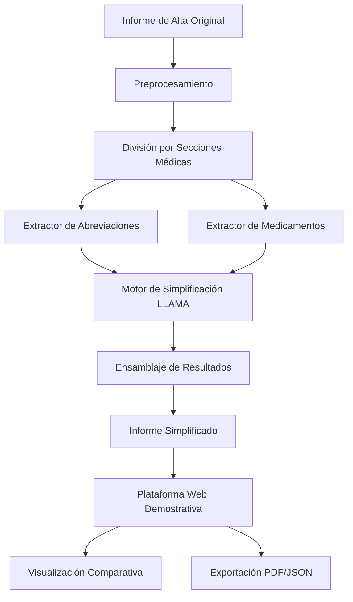

# 🏥 SimpliMED - Subproyecto de Simplificación de Informes Médicos


## 📋 Descripción del Proyecto

**SimpliMED** es el **subproyecto de simplificación de informes médicos** desarrollado como parte del **Trabajo de Fin de Grado (TFG) de Lucas Molino Piñat**, enmarcado dentro del proyecto de investigación **GALENO-IA** de la Universidad de Jaén.

### 🏛️ Contexto: Proyecto GALENO-IA

**GALENO-IA** (*Generación Automática de Lenguaje Claro para Obtención de Informes de Alta*) es un proyecto de investigación concedido a la **Universidad de Jaén** y al **Hospital Universitario de Jaén**, dirigido por las investigadoras principales **María Teresa Martín Valdivia** y **Manuel Carlos Díaz Galiano**.

#### Objetivo General de GALENO-IA
Desarrollar un sistema completo de **generación y simplificación automática de informes de alta hospitalaria en cardiología**, que incluye:
1. **Generación automática** de informes de alta a partir de anamnesis y hojas de evolución
2. **Simplificación automática** de informes médicos para pacientes (SimpliMED)

### 🎯 Enfoque de SimpliMED

Este TFG se centra específicamente en el **segundo componente**: la **simplificación automática de informes de alta médicos**, desarrollando un sistema que traduce el lenguaje clínico técnico a un formato comprensible para pacientes y usuarios no especializados, preservando la precisión médica.

> ⚠️ **Nota Importante**: SimpliMED es un prototipo de investigación con carácter **estrictamente académico y demostrativo**. No está destinado para uso clínico real.

## 🔬 Equipos de Investigación

### **Grupo SINAI (Universidad de Jaén)**
- **Especialización**: Procesamiento de Lenguaje Natural y Aprendizaje Automático
- **Experiencia**: Más de 25 años en investigación
- **Infraestructura**: CEATIC con clusters de alto rendimiento y GPUs A100/V100

### **Grupo ReCaH (Hospital Universitario de Jaén)**
- **Especialización**: Cardiología clínica e investigación médica
- **Colaboración**: Validación médica y supervisión clínica

### **Investigadores Participantes**
- **Lucas Molino Piñat**: Desarrollador principal del subproyecto SimpliMED
- **Equipo multidisciplinar**: Informáticos, médicos cardiólogos y personal técnico

## 🎯 Objetivos

### Objetivo Principal
Desarrollar y validar un sistema de **simplificación automática de informes de alta médicos** que traduzca el lenguaje clínico especializado a un formato accesible para pacientes, manteniendo la precisión médica y mejorando la comunicación médico-paciente.

### Objetivos Específicos del Subproyecto SimpliMED
1. **Implementar técnicas de PLN** para simplificación textual en el dominio clínico
2. **Desarrollar modelos especializados** para detección de abreviaciones y medicamentos
3. **Crear sistema modular** de procesamiento por secciones médicas
4. **Validar la efectividad** de la simplificación con enfoque human-in-the-loop
5. **Construir plataforma demostrativa** para visualización y comparación de resultados
6. **Integrar diccionarios especializados** de terminología médica

## 🧪 Hipótesis de Investigación

### Hipótesis Principal de GALENO-IA
La implementación de LLMs y técnicas de simplificación **reducirá significativamente el tiempo de redacción** de informes y permitirá generar **versiones claras y comprensibles para los pacientes**.

### Hipótesis Específicas de SimpliMED
1. **División por secciones**: La segmentación del informe por secciones clínicas mejora la calidad de la simplificación
2. **Expansión de abreviaciones**: La correcta expansión de siglas médicas facilita la comprensión
3. **Explicación farmacológica**: La descripción clara de tratamientos mejora la accesibilidad del contenido

## 🏗️ Arquitectura del Sistema

SimpliMED implementa una arquitectura modular que procesa informes médicos de forma especializada:



### Módulos Principales

1. **Preprocesador**: Normalización y estructuración del texto médico
2. **Segmentador**: División automática por secciones clínicas especializadas
3. **Extractor de Abreviaciones**: Modelo fine-tuned para detección y expansión de siglas médicas
4. **Extractor de Medicamentos**: Identificación de fármacos y generación de explicaciones terapéuticas
5. **Simplificador LLAMA**: Motor principal usando LLAMA 3.2 con prompts especializados
6. **Ensamblador**: Integración coherente de todas las simplificaciones
7. **Interfaz Web**: Plataforma demostrativa para visualización y comparación

## 🚀 Características Técnicas

### Funcionalidades Principales
- **Procesamiento de Informes de Alta**: Análisis específico de documentos cardiológicos
- **Simplificación Contextual**: Adaptación por secciones médicas (motivo, antecedentes, tratamiento, etc.)
- **Detección Inteligente**: Identificación automática de abreviaciones y medicamentos
- **Explicación Terapéutica**: Generación de descripciones comprensibles de tratamientos
- **Comparación Visual**: Interface para contrastar original vs simplificado
- **Validación Médica**: Preparado para revisión por especialistas

### Tipos de Secciones Procesadas
- **Motivo de Consulta**: Simplificación de la razón de hospitalización
- **Antecedentes**: Clarificación del historial médico relevante
- **Exploración Física**: Traducción de hallazgos clínicos
- **Tratamiento**: Explicación comprensible de medicamentos y terapias
- **Juicio Clínico**: Simplificación del diagnóstico y pronóstico
- **Revisiones**: Indicaciones para seguimiento posterior

## 🛠️ Tecnologías

### Backend (Core del Sistema)
- **Python 3.8+**: Procesamiento de IA y lógica médica especializada
- **PyTorch**: Framework para modelos de deep learning
- **Transformers (Hugging Face)**: Biblioteca para modelos de lenguaje
- **LLAMA 3.2 8B Instruct**: Modelo principal de simplificación
- **Modelos Fine-tuned**: Extractores especializados entrenados en terminología médica

### Servidor y API
- **Node.js + Express**: API REST para comunicación frontend-backend
- **Sistema de archivos**: Gestión de documentos y resultados temporales

### Frontend
- **HTML/CSS/JavaScript**: Interfaz web responsiva y accesible
- **Bootstrap**: Framework de diseño médico profesional
- **Visualización comparativa**: Herramientas de contraste textual

### Datos y Configuración
- **YAML + Python**: Sistema flexible de configuración
- **CSV**: Diccionario de abreviaciones médicas contextualizadas
- **JSON**: Base de datos de medicamentos con explicaciones terapéuticas

## 📦 Estructura del Proyecto

```
SimpliMED/
├── README.md                      # Documentación principal
└── src/                           # Código fuente
    ├── backend/                   # Lógica del servidor y procesamiento
    │   ├── api.js                 # API REST Node.js
    │   ├── core/                  # Núcleo del sistema SimpliMED
    │   │   ├── builder_production.py     # Constructor del pipeline
    │   │   ├── production.py             # Script principal de producción
    │   │   ├── config/                   # Configuraciones del sistema
    │   │   │   ├── base_config.py        # Configuración base
    │   │   │   ├── production_config.py  # Configuración de producción
    │   │   │   └── *.yaml                # Archivos de configuración YAML
    │   │   ├── dataset/                  # Recursos de datos médicos
    │   │   │   ├── abreviaciones.csv     # Diccionario de abreviaciones médicas
    │   │   │   └── medicamentos.json     # Base de datos de medicamentos
    │   │   ├── data_structures/          # Estructuras de documentos médicos
    │   │   │   ├── Anamnesis.py          # Estructura para anamnesis
    │   │   │   ├── Hoja_Evolucion.py     # Estructura para evolución
    │   │   │   ├── Informe_Alta.py       # Estructura para informes de alta
    │   │   │   └── Ingreso.py            # Estructura para ingresos
    │   │   ├── models/                   # Modelos de IA especializados
    │   │   │   ├── extractor_abreviaciones/  # Modelo para abreviaciones médicas
    │   │   │   └── extractor_medicamentos/   # Modelo para medicamentos
    │   │   ├── preprocess/               # Preprocesamiento especializado
    │   │   │   ├── processor_alta.py     # Procesador de informes de alta
    │   │   │   ├── processor_anamnesis.py # Procesador de anamnesis
    │   │   │   └── processor_evol.py     # Procesador de evoluciones
    │   │   ├── tasks/                    # Tareas de procesamiento
    │   │   │   ├── assemble.py           # Ensamblaje de resultados
    │   │   │   └── simplification/       # Módulo de simplificación
    │   │   │       └── llama/            # Implementación con LLAMA
    │   │   │           ├── completo.py       # Simplificación completa
    │   │   │           ├── seccionado.py     # Simplificación por secciones
    │   │   │           └── prompts/          # Plantillas de prompts médicos
    │   │   │               ├── prompts_completo/     # Prompts integrales
    │   │   │               └── prompts_seccionado/   # Prompts por sección
    │   │   └── utils/                    # Utilidades especializadas
    │   │       ├── buscador_abreviaciones.py    # Buscador de abreviaciones
    │   │       ├── extractor_medicamentos.py   # Extractor de medicamentos
    │   │       └── utils.py                     # Utilidades generales
    │   ├── package.json               # Dependencias Node.js
    │   ├── requirements.txt           # Dependencias Python
    │   └── run_backend.sh             # Script de ejecución
    ├── frontend/                      # Interfaz de usuario demostrativa
    │   ├── css/                       # Estilos de la plataforma médica
    │   ├── images/                    # Logos institucionales (UJA, SINAI, EPS)
    │   ├── js/                        # Scripts de interacción
    │   └── views/                     # Páginas HTML de la demo
    └── preprocess/                    # Preprocesamiento adicional
        ├── processor_alta.py          # Procesamiento específico de altas
        ├── processor_anamnesis.py     # Procesamiento de anamnesis
        └── processor_evol.py          # Procesamiento de evoluciones
```

## 🔧 Instalación

### Prerrequisitos

- **Python 3.8+** con capacidades de GPU (recomendado)
- **Node.js 14+** para el servidor web
- **Git** para clonar el repositorio
- **Entorno virtual Python** (recomendado)

### Instalación Paso a Paso

1. **Clonar el repositorio**
   ```bash
   git clone https://github.com/lmolino03/simplimed.git
   cd simplimed
   ```

2. **Configurar el entorno Python (Backend Core)**
   ```bash
   # Crear entorno virtual especializado
   python -m venv venv_simplimed
   source venv_simplimed/bin/activate  # En Windows: venv_simplimed\Scripts\activate
   
   # Instalar dependencias del core
   cd src/backend/core
   pip install -r requirements.txt
   ```

3. **Configurar el servidor API**
   ```bash
   # Navegar al backend
   cd ../
   npm install
   ```

4. **Verificar configuración médica**
   ```bash
   # Verificar datasets médicos
   ls core/dataset/
   # abreviaciones.csv  medicamentos.json
   
   # Verificar modelos entrenados
   ls core/models/
   # extractor_abreviaciones/  extractor_medicamentos/
   ```

## 🚀 Uso del Sistema

### Iniciar SimpliMED

```bash
# Opción 1: Script automatizado
cd src/backend
./run_backend.sh

# Opción 2: Ejecución manual
node api.js

# Acceso a la plataforma: http://localhost:3000
```

### API Endpoints Disponibles

| Endpoint | Método | Descripción | Uso |
|----------|--------|-------------|-----|
| `/` | GET | Página principal de SimpliMED | Interface principal |
| `/upload` | POST | Subida de informes médicos | Carga de documentos |
| `/performance` | GET | Métricas de simplificación | Análisis de rendimiento |
| `/preview` | GET | Vista previa de resultados | Comparación de textos |

### Flujo de Trabajo

1. **📤 Cargar Informe**: Subir informe de alta médico (PDF/texto)
2. **🔍 Análisis Automático**: El sistema procesa y segmenta el documento
3. **🧠 Simplificación IA**: LLAMA procesa cada sección con prompts especializados
4. **💊 Enriquecimiento**: Expansión de abreviaciones y explicación de medicamentos
5. **📊 Comparación**: Visualización lado a lado (original vs simplificado)
6. **✅ Validación**: Revisión de resultados para ajustes
7. **💾 Exportación**: Descarga en PDF o JSON estructurado

## 📊 Validación y Resultados

### Metodología de Evaluación

#### **Evaluación Cualitativa**
- **Revisión médica**: Cardiólogos del Hospital Universitario de Jaén
- **Criterios**: Precisión médica, claridad, comprensibilidad
- **Enfoque human-in-the-loop**: Supervisión médica constante

#### **Evaluación Cuantitativa**
- **Métricas de detección**: Precisión en abreviaciones y medicamentos
- **Análisis por secciones**: Efectividad de la segmentación médica
- **Comparación de enfoques**: Simplificación completa vs seccionada

### Resultados Preliminares

Los resultados del subproyecto SimpliMED han mostrado **prometedores avances**:
- ✅ **Validación de hipótesis**: Las tres hipótesis planteadas muestran resultados positivos
- ✅ **Mejora en comprensión**: Incremento significativo en la accesibilidad de informes
- ✅ **Precisión médica**: Mantenimiento de la información clínica esencial
- ✅ **Viabilidad técnica**: Demostración del potencial de la metodología desarrollada

> **Nota**: Los resultados son preliminares y corresponden a la fase de prototipado académico del TFG.

## 🎯 Contribuciones del TFG

### Contribuciones Técnicas
1. **Sistema modular de simplificación** médica especializada
2. **Modelos fine-tuned** para terminología médica española
3. **Diccionario contextualizado** de abreviaciones cardiológicas
4. **Pipeline de procesamiento** por secciones médicas especializadas
5. **Prompts especializados** para cada tipo de contenido médico
6. **Plataforma demostrativa** para validación y comparación

### Contribuciones Metodológicas
1. **Validación experimental** de técnicas de simplificación médica
2. **Enfoque por secciones** vs simplificación integral
3. **Integración de conocimiento médico** en modelos de lenguaje
4. **Metodología de evaluación** para simplificación clínica

## 🔬 Beneficios Esperados (Proyecto GALENO-IA)

### Impacto Clínico
- **Reducción del tiempo de redacción** de informes en al menos 20%
- **Mejora de la comprensión** de pacientes en un 50%
- **Mayor disponibilidad médica** para tareas asistenciales directas

### Impacto Social
- **Pacientes más informados** y partícipes de su salud
- **Comunicación médico-paciente** más efectiva
- **Accesibilidad sanitaria** mejorada para todos los niveles educativos

### Impacto Científico
- **Avance en IA médica** aplicada al español
- **Metodologías reproducibles** para otros dominios médicos
- **Contribución al PLN médico** en lenguas romances

## ⚠️ Limitaciones y Consideraciones

### Limitaciones Técnicas
- **Prototipo académico**: No apto para uso clínico real
- **Dominio específico**: Optimizado para cardiología
- **Idioma**: Entrenado específicamente para español médico
- **Supervisión requerida**: Necesita validación médica constante

### Consideraciones Éticas
- **Privacidad**: Datos anonimizados y uso responsable
- **Transparencia**: Limitaciones claramente establecidas
- **Supervisión médica**: Siempre bajo revisión de especialistas
- **Uso académico**: Exclusivamente para investigación y educación

## 🚀 Futuro del Subproyecto

### Desarrollos Inmediatos
- **Validación extendida** con más casos clínicos
- **Métricas cuantitativas** más robustas
- **Interfaz de edición** para revisión médica
- **Integración completa** con el sistema de generación de GALENO-IA

### Escalabilidad a Largo Plazo
- **Extensión a otras especialidades** médicas
- **Adaptación a normativas** sanitarias (HL7, FHIR)
- **Sistema de producción** para entornos clínicos reales
- **Integración hospitalaria** con flujos de trabajo existentes

## 🌍 Impacto en los ODS

SimpliMED, como parte de GALENO-IA, contribuye a los **Objetivos de Desarrollo Sostenible**:

- **🏥 ODS 3** (Salud y Bienestar): Mejora del acceso a información sanitaria comprensible
- **🎓 ODS 4** (Educación de Calidad): Alfabetización en salud para todos los ciudadanos
- **⚖️ ODS 10** (Reducción de Desigualdades): Accesibilidad independiente del nivel educativo
- **🏛️ ODS 16** (Instituciones Sólidas): Transparencia en la información sanitaria pública
- **🤝 ODS 17** (Alianzas): Colaboración universidad-hospital-sociedad


---

**SimpliMED** representa una contribución significativa al proyecto GALENO-IA, demostrando el potencial de la inteligencia artificial para **mejorar la comunicación médico-paciente** y la **accesibilidad de la información sanitaria**. Como subproyecto del TFG de Lucas Molino Piñat, sienta las bases técnicas para futuras aplicaciones clínicas en el marco de la investigación colaborativa universidad-hospital.


