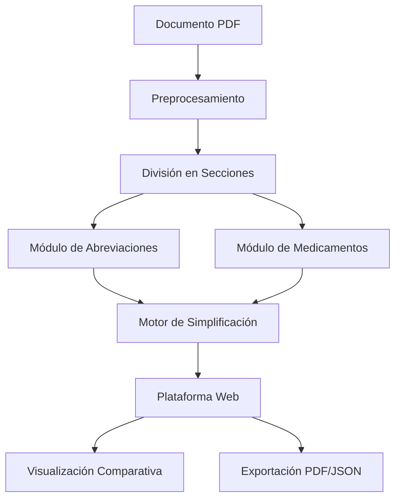

# 📄 SimpliMED - Simplificación Automática de Informes Médicos

## 📋 Descripción

**SimpliMED** es un sistema innovador orientado a la **simplificación automática de informes médicos de alta hospitalaria en el ámbito de la cardiología**. Su objetivo principal es **traducir el lenguaje clínico técnico a un nivel comprensible para pacientes y usuarios no especializados**, preservando la precisión médica y facilitando la comunicación médico-paciente.

El proyecto combina técnicas avanzadas de **Procesamiento del Lenguaje Natural (PLN)**, **modelos de lenguaje de última generación (LLMs)** y una **plataforma web interactiva** desarrollada como parte de un Trabajo Fin de Grado (TFG).

> ⚠️ **Nota Importante**: Este proyecto tiene un carácter **estrictamente académico y demostrativo**. No está destinado para uso clínico real.

## 🎯 Objetivos

### Objetivo Principal
Evaluar la viabilidad de simplificar informes clínicos mediante PLN, explorando cómo la división por secciones, el manejo de abreviaciones médicas y la explicación de tratamientos farmacológicos mejoran la claridad de los textos médicos.

### Objetivos Específicos
- **Análisis de estrategias** de simplificación textual en el dominio clínico
- **Evaluación de modelos de lenguaje** ligeros y avanzados para simplificación médica
- **Desarrollo de técnicas de prompting** específicas por sección del informe
- **Implementación de plataforma web** como demostrador funcional
- **Construcción de diccionario** de abreviaciones clínicas personalizado
- **Validación experimental** mediante evaluación cualitativa y cuantitativa

## 🧪 Hipótesis Planteadas

1. **Hipótesis 1**: La división del informe por secciones clínicas mejora la calidad de la simplificación
2. **Hipótesis 2**: La expansión correcta de abreviaciones médicas facilita la comprensión de los informes  
3. **Hipótesis 3**: La explicación del tratamiento y de los medicamentos mejora la accesibilidad del contenido

## 🏗️ Arquitectura del Sistema

SimpliMED está organizado en módulos integrados que trabajan de forma cohesiva:



### Componentes Principales

1. **Preprocesamiento**: Normalización y preparación del texto de entrada
2. **División en secciones clínicas**: Segmentación especializada (antecedentes, diagnóstico, tratamiento, etc.)
3. **Módulo de abreviaciones**: Detección y expansión usando diccionario especializado
4. **Módulo de medicamentos**: Identificación de fármacos y generación de explicaciones terapéuticas
5. **Motor de simplificación**: Utiliza LLMs (LLAMA 3.2 8B Instruct) para reescribir en lenguaje claro
6. **Plataforma web**: Interfaz interactiva para demostración y visualización

## 🚀 Características

### Funcionalidades Principales
- **Procesamiento de PDFs**: Carga y análisis de documentos médicos
- **Extracción Inteligente**: Identificación automática de medicamentos y abreviaciones
- **Simplificación Contextual**: Generación de resúmenes comprensibles por secciones
- **Visualización Comparativa**: Comparación lado a lado entre original y simplificado
- **Diccionario Integrado**: Consulta de abreviaciones médicas contextualizadas
- **Exportación Múltiple**: Resultados en PDF y JSON

### Tipos de Documentos Soportados
- Anamnesis
- Hojas de Evolución
- Informes de Alta
- Informes de Ingreso

## 🛠️ Tecnologías

### Backend
- **Python 3.8+**: Procesamiento de IA y lógica de negocio
- **Node.js + Express**: Servidor web y API REST
- **PyTorch**: Framework de machine learning
- **Transformers**: Modelos de lenguaje natural

### Frontend
- **HTML/CSS/JavaScript**: Interfaz de usuario responsiva
- **Bootstrap**: Framework de diseño
- **Interfaz intuitiva**: Optimizada para usabilidad

### Modelos de IA
- **LLAMA 3.2 8B Instruct**: Modelo principal de simplificación
- **Modelos especializados**: Entrenados para terminología médica española
- **Pipeline modular**: Procesamiento por tareas específicas

## 📦 Estructura del Proyecto

```
SimpliMED/
├── data/                           # Datos de entrada y salida
│   ├── H_OutputData/              # Datos de salida (histórico)
│   ├── H_ProductionData/          # Datos de producción (histórico)
│   ├── OutputData/                # Datos de salida actuales
│   └── ProductionData/            # Datos de producción actuales
├── server/                        # Servidor Node.js
│   ├── public/                    # Archivos estáticos
│   │   ├── css/                   # Hojas de estilo
│   │   ├── js/                    # Scripts del frontend
│   │   ├── images/                # Recursos gráficos
│   │   └── views/                 # Páginas HTML
│   ├── tempUploads/               # Archivos temporales
│   ├── server.js                  # Servidor principal
│   └── package.json               # Dependencias Node.js
├── src/                           # Código fuente Python
│   ├── config/                    # Configuraciones del sistema
│   ├── data_structures/           # Estructuras de datos médicas
│   ├── models/                    # Modelos de IA entrenados
│   ├── preprocess/                # Preprocesamiento de datos
│   ├── tasks/                     # Tareas de procesamiento
│   ├── utils/                     # Utilidades y helpers
│   └── production.py              # Script principal de producción
├── docs/                          # Documentación del proyecto
├── requirements.txt               # Dependencias Python
└── README.md                      # Este archivo
```

## 🔧 Instalación

### Prerrequisitos

- **Node.js** (v14 o superior)
- **Python** (v3.8 o superior)
- **npm** o **yarn**
- **Git**

### Instalación Paso a Paso

1. **Clonar el repositorio**
   ```bash
   git clone https://github.com/tu-usuario/SimpliMED.git
   cd SimpliMED
   ```

2. **Configurar el entorno Python**
   ```bash
   # Crear entorno virtual (recomendado)
   python -m venv venv
   source venv/bin/activate  # En Windows: venv\Scripts\activate
   
   # Instalar dependencias Python
   cd src
   pip install -r requirements.txt
   ```

3. **Configurar el servidor Node.js**
   ```bash
   cd ../server
   npm install
   ```

4. **Verificar configuraciones**
   ```bash
   # Verificar configuraciones en src/config/
   # Asegurar que los modelos están en src/models/
   ```

## 🚀 Uso

### Iniciar la Aplicación

```bash
# Terminal 1: Iniciar servidor Node.js
cd server
node server.js

# La aplicación estará disponible en http://localhost:3000
```

### API Endpoints

| Endpoint | Método | Descripción |
|----------|--------|-------------|
| `/` | GET | Página principal |
| `/upload` | POST | Subir documentos PDF |
| `/performance` | GET | Página de rendimiento |
| `/preview` | GET | Vista previa de resultados |

### Guía de Uso Web

1. **📤 Subir documento**: Selecciona un archivo PDF médico desde la interfaz
2. **⚙️ Procesar**: El sistema extraerá automáticamente información relevante
3. **🔍 Revisar resultados**: Visualiza medicamentos, abreviaciones expandidas y texto simplificado
4. **📊 Comparar**: Ve la comparación lado a lado entre original y simplificado
5. **💾 Descargar**: Obtén los resultados en formato PDF o JSON

## 📊 Evaluación y Resultados

### Metodología de Evaluación

- **Evaluación Cualitativa**: Revisión por cardiólogos expertos
- **Evaluación Cuantitativa**: Métricas de detección y expansión
- **Validación Experimental**: Subtareas especializadas
- **Ejemplos Ilustrativos**: Casos de uso reales anonimizados

### Resultados Obtenidos

Los resultados fueron **prometedores**, confirmando el potencial de la metodología desarrollada:
- Mejora significativa en la comprensión de informes médicos
- Validación exitosa de las hipótesis planteadas
- Demostración de viabilidad técnica del enfoque

## 📌 Principales Contribuciones

1. **Prototipo Funcional** para simplificación clínica automática
2. **Diccionario Contextualizado** de abreviaciones médicas especializadas
3. **Pipeline Modular** innovador (secciones, abreviaciones, medicamentos)
4. **Corpus Real Anonimizado** de cardiología para investigación
5. **Modelos Especializados** entrenados para el dominio médico español
6. **Plataforma Web Interactiva** como demostrador académico
7. **Validación Experimental** de hipótesis sobre simplificación clínica

## ⚠️ Limitaciones y Consideraciones

### Limitaciones Técnicas
- **Uso académico exclusivamente**: No apto para uso clínico real
- **Normativas**: No cumple estándares sanitarios (HL7, FHIR)
- **Dependencias**: Requiere recursos locales para algunas funciones
- **Idioma**: Optimizado para español médico

### Consideraciones Éticas
- Datos anonimizados y uso responsable
- Transparencia en las limitaciones del sistema
- Enfoque en la mejora de la comunicación médico-paciente

## 🚀 Futuro del Proyecto

### Desarrollos Planificados
- **Adaptación Clínica**: Cumplimiento de estándares de interoperabilidad y privacidad
- **Interfaz Avanzada**: Edición y validación interactiva por expertos
- **Validación Extendida**: Mayor número de informes y especialistas
- **Sistema de Apoyo Real**: Herramienta para profesionales y pacientes

### Escalabilidad
- Extensión a otras especialidades médicas
- Integración con sistemas hospitalarios existentes
- Mejoras en precisión y cobertura terminológica

## 🌍 Impacto Social y ODS

SimpliMED contribuye directamente a los **Objetivos de Desarrollo Sostenible**:

- **🏥 ODS 3** (Salud y Bienestar): Mejora la alfabetización en salud
- **🎓 ODS 4** (Educación de Calidad): Promueve educación en salud accesible
- **⚖️ ODS 10** (Reducción de Desigualdades): Facilita comprensión a usuarios con barreras
- **🏛️ ODS 16** (Instituciones Sólidas): Fomenta transparencia sanitaria
- **🤝 ODS 17** (Alianzas): Colaboración interdisciplinar

## 📄 Licencia

Este proyecto se distribuye bajo licencia académica. Ver el archivo [LICENSE](LICENSE) para más detalles.

## 👥 Contribuciones

Este proyecto fue desarrollado como Trabajo Fin de Grado. Para contribuciones académicas o colaboraciones, contacta a través de los canales oficiales de la institución.

## 📞 Contacto y Soporte

Para consultas académicas o técnicas relacionadas con SimpliMED, puedes:
- Abrir un issue en este repositorio
- Contactar a través de la institución académica correspondiente

## 🙏 Agradecimientos

Agradecimiento especial a:
- Profesores y tutores del proyecto
- Cardiólogos expertos que participaron en la validación
- Comunidad académica y de investigación en PLN médico

---

**SimpliMED** representa un avance significativo en la aplicación de la inteligencia artificial para mejorar la accesibilidad y comprensión de la información médica, sentando las bases para futuras aplicaciones en comunicación médico-paciente y accesibilidad sanitaria.

